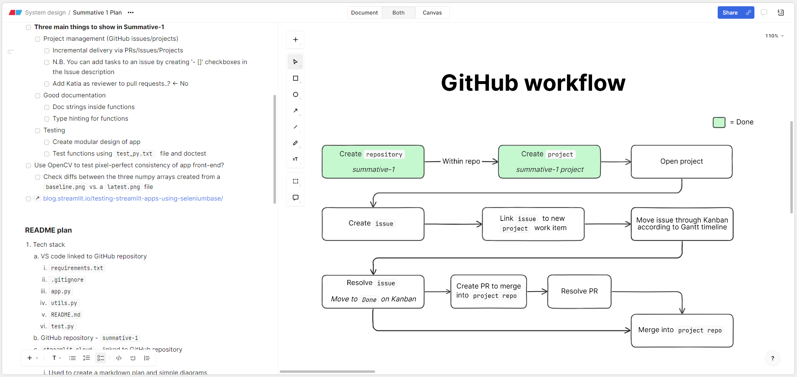
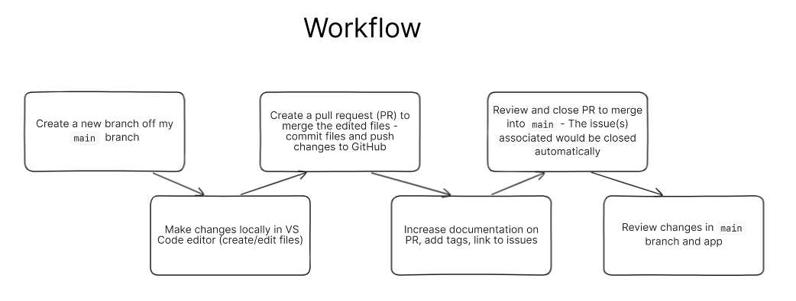

# Summative Assignment 1 - Software Engineering

View the app [here](https://summative-1.streamlit.app/).

> NOTE: If the app has been dormant for a period of time, it might require starting back up again. It will take about 5 minutes for the hosting service, Streamlit, to build. 

## Introduction
The `streamlit` app created for this project and hosted in [Streamlit Community Cloud](https://streamlit.io/cloud) is designed to help teach some of the concepts in Natural Language Processing (NLP). The app allows a user to enter text into the free-text area and explore how this text is processed by two NLP libraries, `SpaCy` and `NLTK`. The application in my workplace would be that it can help apprentice Data Analysts and Data Scientists to better understand some of the foundational concepts of NLP so they can use them in their own projects.

[Tokenisation](https://www.datacamp.com/blog/what-is-tokenization) is an unavoidable primary step in any NLP task, however this is handled differently depending on which tokenisation algorithm is used. The first section of the app allows the user to explore the word and sentence tokeniser in a SpaCy pipeline, as well as four tokeniser algorithms from NLTK - the whitespace, punkt, treebank, and twitter tokenisers. The user can further switch between two language models in SpaCy - `en_core_web_sm` and `en_core_web_md`.

[Part Of Speech (POS) tagging](https://spacy.io/usage/linguistic-features#pos-tagging) is an important element of NLP that helps provide context to words and sentences. It is used in subsequent steps of NLP like [dependency parsing](https://towardsdatascience.com/natural-language-processing-dependency-parsing-cf094bbbe3f7#:~:text=Dependency%20Parsing%20is%20the%20process,dependent%20that%20modifies%20the%20head.). The second section of the app allows the user to explore a selection of tags each token is assigned that can aid additional NLP analysis. This is presented to the user in a dataframe.

## Requirement Engineering & Product Design
Before beginning any software project, it is important to have a solid idea of what is to be achieved. Assessing the scope and requirements of a project allowed me to choose the appropriate tech stack to build the app in. I followed a [prototype model](https://www.codecademy.com/resources/docs/general/software-development-life-cycle/prototype-model) of development where I first designed a [low-fidelity](https://www.figma.com/resource-library/low-fidelity-prototyping/) prototype of the user interface in [Figma](https://www.figma.com/design/hO5OI38rTR5yRAnESyqplh/Summative?node-id=0-1&t=NZU4ztBAqT0IjJh4-1) which allowed me to better understand the placement of key elements of the app's UI and core functionality I would need to build into it.

In order to create work items for this projects it was important to understand what software stack and features I would need to include in the project. I had a loose idea to create an NLP learning tool, but to fully understand what it would look like I relied on the Figma prototype to guide this decision. I initially created three frames within Figma following a plan to split the app into three sections, Tokenisation, Part of Speech Tagging, and Dependency Tree Parsing. The design for the first page can be seen below:

[](https://www.figma.com/design/hO5OI38rTR5yRAnESyqplh/Summative?node-id=0-1&t=NZU4ztBAqT0IjJh4-1)

The user would be able to input text into a free-text area and see that text split into individual tokens based on two NLP packages, SpaCy and NLTK. Each individual token would be highlighted a different colour to emphasise how the text had been split by the different models. The user would then be able to select between a variety of pre-selected tokenisers that would illustrate the nuances of each tokeniser.

By creating a low fidelity prototype, I was able to understand what functions I would need to develop and what outputs they would likely have to have in order to implement the features I had already designed. In order to develop these functions, I took a Test Driven Development (TDD) approach.

During the early stages of my product design I found it useful to use a tool called [Eraser](https://app.eraser.io/) to sketch out plans and workflows. Eraser's functionality to keep markdown-editable documents and diagrams integrated closely together helped me to visualise and understand the steps I would need to take in order to achieve specific elements of my app. For example, I kept a high-level project plan and detailed elements of it using diagrams:



## Test Driven Development (TDD)
At first I began by writing docstring tests within the function itself and testing them with the [doctest library](https://docs.python.org/3/library/doctest.html). An early example of this is shown below:

```python

def spacy_token_annotator(doc, model: str) -> list[tuple[str]]:
    """
    Tokenise a SpaCy Doc object and annotate a list of strings 
    with hex colours in a format conforming to
    the accepted input for the annotated_text package

    >>> nlp = spacy.load("en_core_web_sm")
    >>> doc = nlp("This is a test. :-)") 
    >>> token_annotator(doc = doc, model = "spacy_sents")
    [('This is a test. :-)', '', '#8ef')]

    """ 
    pass
# end

```

The code above shows I have named a function and type hinted what I expect the inputs and output of the function to be. I have then created an extensive doc string where I have given a brief explanation of the function and then included a relatively simple doctest. In this example the function should take a SpaCy doc object as input and a model to tokenise the input by. The output should be a list of tuples of strings. This is reflected in the expected output written immediately after the executable three-chevron section where I have specified the list of tuples of strings format that should be returned. For creating docstrings to test tokenisation, I took inspiration from [NLTK](https://www.nltk.org/api/nltk.tokenize.html#module-nltk.tokenize).

I found doctests to be very useful at this stage because they integrated with the specific functional unit I was attempting to make pass. Running `python -m doctest -v utils.py` in the command line as I adapted the functions code allowed me to continually test if it had passed tests passed, and subsequently allowed me to refactor my code so it was written in a more [pythonic](https://peps.python.org/pep-0008/) and readable way. It also forced me to make my functions more modular. For example, the example test above, `spacy_token_annotator`, was split into two functions because it allowed me to test two logically separate elements of the function - firstly to tokenise an input and secondly to annotate the tokenised list with hex colours. I ended up with two functions to perform token annotation, one called [`tokenise_text`](https://github.com/m-scott-1/summative-1/blob/main/utils.py#L31) and the other called [`token_annotator`](https://github.com/m-scott-1/summative-1/blob/main/utils.py#L58).

As my [`utils.py`](https://github.com/m-scott-1/summative-1/blob/main/utils.py) functions became more advanced I moved the testing to a designated file called [`testing_module.md`](https://github.com/m-scott-1/summative-1/blob/main/testing_module.md). I made my testing more robust, testing multiple outputs, and increased test coverage for the project. The benefit of writing my tests in a markdown document was that I could use its mark-up syntax to render the document in GitHub in a readable way whilst at the same time including python code blocks with the chevron syntax which would indicate to execute the tests. I was able to run `python -m doctest -v testing_module.md` to see a verbose output of my tests:


Above, 11 tests have been passed.

## GitHub Software Engineering Practices
Firstly, in order to work efficiently and follow the principles of [continuous integration and delivery (CI/CD)](https://about.gitlab.com/topics/ci-cd/) as far as possible, it was important to link my VS Code editor to my GitHub account. I then needed to check I could successfully link my GitHub repo to Streamlit Cloud and see merged changes into my repo's code base automatically reflected as changes in the app. In order to track work items such as this I created GitHub Issues.

I used GitHub [Issues](https://docs.github.com/en/issues/tracking-your-work-with-issues/about-issues) to capture the requirements of the project, initially starting with the foundational steps I would need to implement to get my application working such as proofs of concept where I uploaded a simple app and checked it built correctly in Streamlit Cloud. This type of prototype testing allowed me to identify areas I would need to change. For example, when it didn't build as it had been doing locally in the cloud, I needed to look at the Streamlit logs to identify the issue, capture it in a GitHub Issue, read documentation to find a solution, and finally publish a working prototype and close the Issue. I identified I needed to use a [`requirements.txt`](https://github.com/m-scott-1/summative-1/blob/main/requirements.txt) file (rather than `requirements.yaml`) when the app didn't build as expected the first time.

I made sure to give each issue specific passing requirements, and tag them with the area the issue was related to. For example, an early issue to test a proof of concept that I could publish changes to GitHub and have them automatically integrate into a linked Streamlit Cloud App looked like this:

[](https://github.com/m-scott-1/summative-1/issues/5)

The closing criteria for this issue outlined in the description was that when changes are merged to the main branch of my repository, the app should update. This issue was linked to a label, POC (Proof of Concept), and a project. I added comments to the issue to confirm why the issue was being closed. Most Issues were linked to pull requests (PRs) except a few early on in the project, and all were linked to a central project I used to manage the continuous delivery of features that developed my app. By linking a PR to an Issue, when I merged the PR it would automatically close the Issue, which would then automatically move the Issue from To Do/In Progress on my project's Kanban board to Done. Taking advantage of GitHubs built in automation features like this allowed me to work efficiently through this project.

As mentioned, I used a [GitHub Project](https://docs.github.com/en/issues/planning-and-tracking-with-projects) extensively throughout the development process. Each Issue was linked to a central project and given a start and end date, as well as a status on the Kanban Board seen below:

[](https://github.com/users/m-scott-1/projects/1/views/1)

I used four swim lanes called 'To Do', 'In Progress', 'In Review', and 'Done' to track the progress of Issues in an intuitive manner. My workflow typically looked like this:



A second useful view I used that took advantage of the start and end dates I gave all Issues was the [Roadmap view](https://docs.github.com/en/issues/planning-and-tracking-with-projects/customizing-views-in-your-project/changing-the-layout-of-a-view#about-the-roadmap-layout):

[](https://github.com/users/m-scott-1/projects/1/views/3)

This view gave me a high-level view of the project from its start to end date and allowed me to plan my time accordingly to ensure I was splitting work into small, manageable chunks. 

## Accessibility
I used the Google-developed Chrome Developers Tool Lighthouse to test the accessibility of my app. An initial benchmark of the accessibility of my app showed I had room to improve the default accessibility features baked into Streamlit's UI:


In an attempt to improve the accessibility of my app, I first followed the steps outlined by web.dev for conducting a [manual accessibility audit](https://web.dev/articles/how-to-review?utm_source=lighthouse&utm_medium=devtools). I tested how tab navigation worked in the app to make sure I could reach everything that was interactive, and that the focus rings on different elements of the page were clear. I then moved on to checking the colour contrast using the aXe chrome extension. I found that three areas of my app did not meet minimum colour contrast specifications when the default light Streamlit theme was applied. a) and b) would require a custom Streamlit theme to edit them but c) was created by me in my `annotate_text` function and would be easy to change:


I still have some room to improve in my app's accessibility. This is something I intend to do for future work. I have created Issues to capture these improvements which are currently active.

## Design Evaluation
I think the method I have used to design my workflow has worked well. It has allowed me to continuously develop features and deploy them to my app. I have taken advantage of GitHub's built-in automation by linking pull requests to Issues to my project. This has also allowed me to stay in-sync where I have closed a PR that addressed an issue, I have not forgotten to close the Issue or move it to the appropriate swim lane in my project. I enjoyed the help of external software like Figma and Eraser during my project planning. One thing I could have done to improve my project plan was create personas of future users of the app. In my context that would have been future apprentices we have in the team. I could have reflected on my own experience joining the team and learning Data Science concepts to do this which could have helped guide the features I ended up developing.

Whilst I did address accessibility, it could have been more beneficial to incorporate a similar philosophy that I did with my test driven development here. I could have considered all areas of accessibility before building the app and put mechanisms in place whilst developing the apps that could ensure I was developing to a high accessibility standard. For example, this would have caught that one of my hex colours was not high enough contrast when testing my user defined function rather than during the accessibility testing I did after development.

## Future work
- [Increase CI/CD integration to include automatic testing in my pipeline (GitHub Actions)](https://github.com/m-scott-1/summative-1/issues/31)
- [Include a measure of test coverage in my project](https://github.com/m-scott-1/summative-1/issues/32)
- [Implement more accessibility features (hierarchal headers, remove the side bar because it is creating hidden tab navigation behaviour)](https://github.com/m-scott-1/summative-1/issues/29)
- [Create a custom Streamlit theme to increase contrast of text and colours](https://github.com/m-scott-1/summative-1/issues/24)