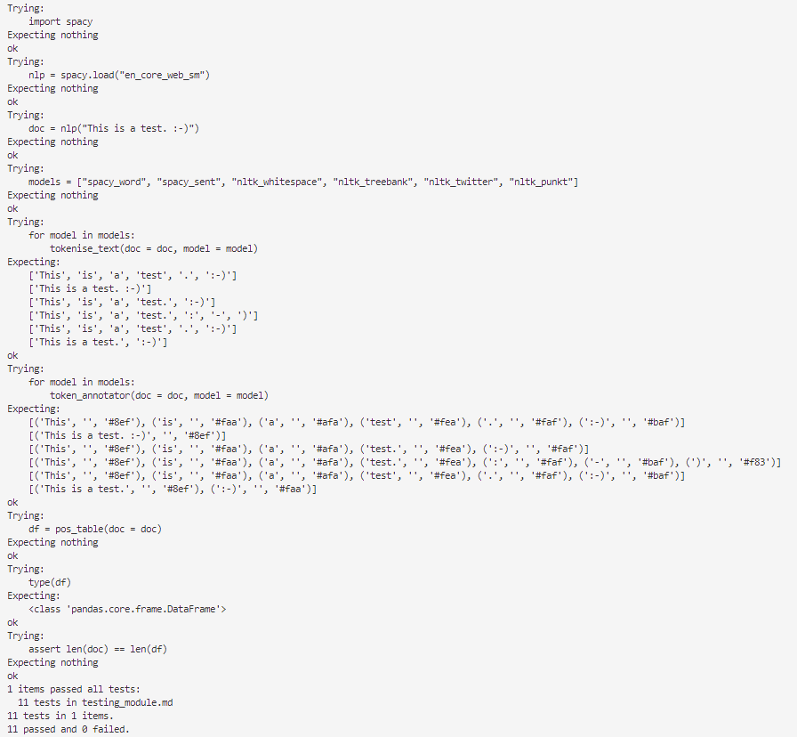

View the app [here](https://summative-1.streamlit.app/).

> NOTE: If the app has been dormant for a period of time, it might require starting back up again. It will take a few minutes for the hosting service, streamlit, to build. 

# Introduction
The `streamlit` app created for this project and hosted in [Streamlit Community Cloud](https://streamlit.io/cloud) is designed to help teach some of the concepts in Natural Language Processing (NLP). The app allows a user to enter text into the free-text area and explore how this text is processed by two NLP libraries, `SpaCy` and `NLTK`. The application in my workplace would be that it can help apprentice Data Analysts and Data Scientists to better understand some of the foundational concepts of NLP so they can use them in their own projects.

[Tokenisation](https://www.datacamp.com/blog/what-is-tokenization) is an unavoidable primary step in any NLP task, however this is handled differently depending on which tokenisation algorithm is used. The first section of the app allows the user to explore the word and sentence tokeniser in a SpaCy pipeline, as well as four tokeniser algorithms from NLTK - the whitespace, punkt, treebank, and twitter tokenisers. The user can further switch between two language models in SpaCy - `en_core_web_sm` and `en_core_web_md`.

[Part Of Speech (POS) tagging](https://spacy.io/usage/linguistic-features#pos-tagging) is an important element of NLP that helps provide context to words and sentences. It is used in subsequent steps of NLP like dependency parsing. The second section of the app allows the user to explore a selection of tags each token is assigned that can aid additional NLP analysis.

# Requirement Engineering & Product Design
Before beginning any software project, it is important to have a solid idea of what is to be achieved. Assessing the scope and requirements of a project allowed me to choose the appropriate tech stack to build the app in. 

In order to create work items for this projects it was important to understand what software stack and features I would need to include in the project. I had a loose idea to create an NLP learning tool, but to fully understand what it would look like I first used Figma to create a prototype of the app. I initially created three frames within Figma with the idea to split the app into three sections, Tokenisation, Part of Speech Tagging, and Dependency Tree Parsing. The design for the first page can be seen below:

The used would be able to input text into a free-text area and see that text split into individual tokens based on two NLP packages, SpaCy and NLTK. Each individual token would be highlighted a different colour to emphasise how the text had been split by the different models. The user would then be able to select between a variety of pre-selected tokenisers that would illustrate the nuances of each tokeniser.

My Figma board can be viewed [here](https://www.figma.com/design/hO5OI38rTR5yRAnESyqplh/Summative?node-id=0-1&t=NZU4ztBAqT0IjJh4-1).

Firstly, in order to work efficiently and follow the principles of software engineering, it was important to set up continuous integration and development (CI/CD) for this project. I did this by linking my GitHub account to VS Code using a remote repository. 

# GitHub Software Engineering Practices
I used GitHub [Issues](https://docs.github.com/en/issues/tracking-your-work-with-issues/about-issues) to capture the requirements of the project, initially starting with the foundational steps I would need to implement to get am application working.

I made sure to give each issue specific passing requirements, and tag them with the area the issue was related to. For example, an early issue to test a proof of concept that I could publish changes to GitHub and have them automatically integrate into a linked Streamlit Cloud App looked like this:

The closing criteria for this issue outlined in the description was that when changes are merged to the main branch of my repository, the app should update. This issue was linked to a label, POC  - which stands for proof of concept, and a project. I added comments to the issue to confirm why the issue was being closed. Most Issues were linked to pull requests except a few early on in the project, and all were linked to a central project I used to manage the continuous deployment of features to develop my app.

I used a [GitHub Project](https://docs.github.com/en/issues/planning-and-tracking-with-projects) extensively throughout this the development process. Each Issue was linked to a central project and given a start and end date, as well as a status on the Kanban Board seen below:

I used four swim lanes called 'To Do', 'In Progress', 'In Review', and 'Done' to track the progress of Issues in an intuitive manner.

A second useful view I used that took advantage of the start and end dates I gave all Issues was the [Roadmap view](https://docs.github.com/en/issues/planning-and-tracking-with-projects/customizing-views-in-your-project/changing-the-layout-of-a-view#about-the-roadmap-layout):

This view gave me a high-level view of the project from it's start to end date and allowed me to plan my time accordingly to ensure I was splitting work into small, manageable chunks.

# Test Driven Development (TDD)
My intention was to make the streamlit app as modular as possible by including a `utils.py` file that contained user defined functions. I created functions to split a text into tokens based on an NLP model and output a list of strings. This output would then feed into another function that would annotate the list with hex colours in a format conforming to the accepted input for the `annotate_text`  package. A third function would create a Pandas DataFrame from a SpaCy Doc object by tagging each token with different parts of speech.

Before I wrote the functions proper, I follow TDD practices and wrote the tests the functions should pass and included them in a markdown file called `testing_module.md` . I then used the built in python library [doctest](https://docs.python.org/3/library/doctest.html) to ensure my functions passed. By running `python -m doctest -v testing_module.md` in the command line, I was able to produce a verbose output based on the testing modules tests:

Above, 11 tests have been passed. 
